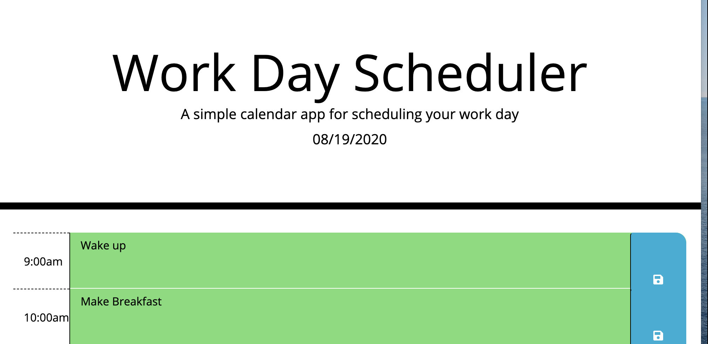

# HTML Schedule

> This is a simple HTML schedule that allows users to write appointments and stores them in local storage.

## Table of Contents

- [Deployment](#Deployment)
- [Usage](#usage)
- [Technologies](#technologies)
- [Look](#look)

## Deployment

[Deployment](https://septumprince.github.io/password-generator/)

## Usage

To use this application, click the link above to view the website on GitHub Pages.

Click the "Generate Password" button. You will be asked a series of questions about the kind of password you would like to generate. Once you have finished, the password matching those requirements will be displayed.

## Technologies

The following languages and technologies were used in the creation of this website:

- JavaScript
- HTML/CSS
- VSCode, GitHub

## Look

